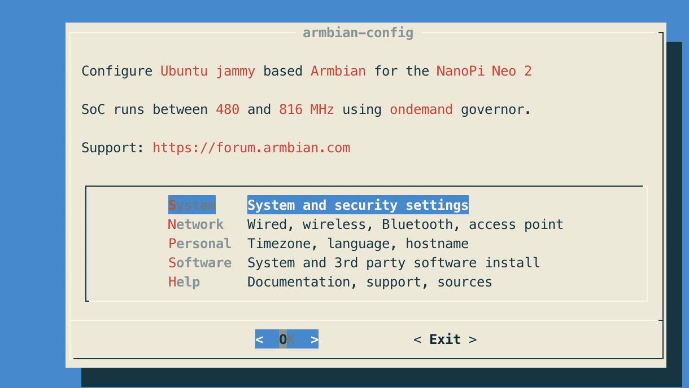
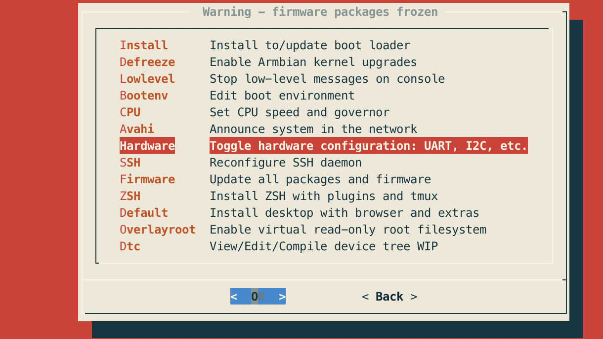
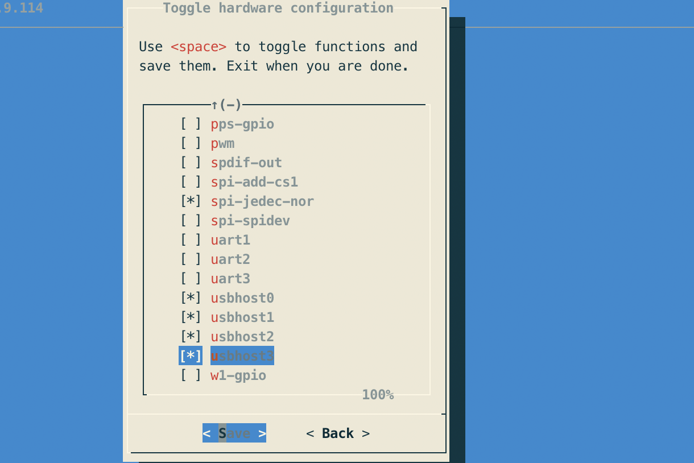

# KVMD-ARMBIAN
这个项目是针对nanopi-neo2 安装kvmd的教程。参考了项目[https://github.com/srepac/kvmd-armbian]， 详细介绍请参考原项目。

# 写在前面
## PIKVM
PIKVM 是基于RPI的一个ip-KVM项目，可以通过网络远程控制电脑安装系统，开关机等操作。是远程维护的一个很好杀器。

翻出来了之前的RPI4(很久以前200块淘的),安装体验了一番，很好用。后来想多做一个，无奈RPI4现在价格感人~，遂寻早替代方案，最后找到kvmd-armbian的方案。决定尝试一番。这个方案总成本不到130RMB，还是很有性价比的。

## 需要准备的硬件
* nanopi neo2 （咸鱼78 不包邮）

* tf卡（我用淘汰下来的，0成本，新买约25包邮）
* HDMI usb采集器 （全新39包邮）

* 2xG3VM-61A1(光耦合模块) + 2x390欧电阻 + 杜邦线若干 （约5RMB）
* 工具电烙铁
总 130RMB左右

## 焊接ATX模块(可选)
由于我觉得指示灯没有用，这里我只焊接了开机和重启线
- 电路图如下

- 我自己焊的成品，很简单的，大家可以试一下

- 装起来是这样


# 安装指南
## Step 1
- 去官网下载最新的armbian镜像包[https://www.armbian.com/nanopi-neo-2/], 注意，要下载Jammy版的，python版本更高，安装kvmd可以避免很多问题。
- 刷镜像到TF卡里面， 可以使用balenaEtcher这个工具[https://www.balena.io/etcher].
- 把卡插上，插上网线，插上电，等开机
- ssh 登陆到板子，用户名密码：root/root，登陆后会让你改密码

## Step 2（ssh登陆到板子操作,使用root账号）
- 更新系统
```bash
apt update
apt upgrade
```
- 开启usb otg的功能
```bash
armbian-config
```
依次选择system->hardware

hardware


把usbhost0/1/2/3全选了（使用空格选择）

保存，按照提示重启。

## Step 3（安装第一部分）
```bash
cd ～
apt install -y git vim make python3-dev gcc
python3 -m pip config set global.index-url https://pypi.tuna.tsinghua.edu.cn/simple
git clone https://github.com/Neo-Vincent/kvmd-armbian.git
cd kvmd-armbian
./install.sh
```
这个时间可能会比较久，中间需要按回车键继续。

## Step 4 (安装第二部分)
- 重启后再次运行安装脚本（有可能需要再重启一次，但是我不需要）
```bash
cd kvmd-armbian
./install.sh
```

## Step 5
- 现在可以打开板子的ip来体验pikvm了
主机完整外观

体验一下远程改一下bios～
{:height="100px" width="400px"}